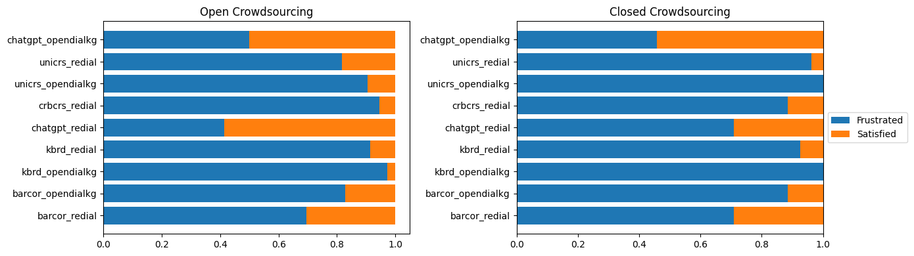
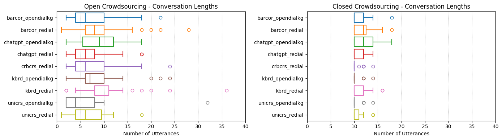
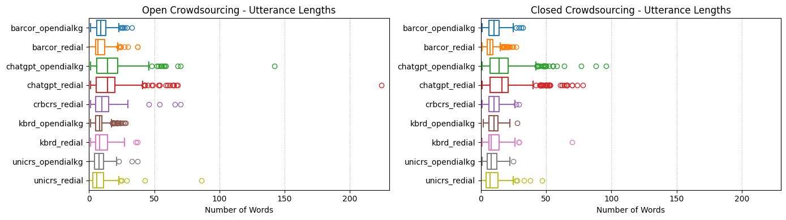

# Analysis of CRSArena-Dial

The code to create the analysis is available in this [Jupyter notebook](tool/analysis.ipynb). The analysis comprises three main sections:

1. **Conversation analysis**: This section provides insights into the distribution of the number of conversations per CRS and their structure.
2. **CRS ranking**: This section uses the pairwise comparisons to rank the CRSs based on human feedback.
3. **Correlation analysis**: This section investigates the correlation between the results obtained from the data collected in the open and closed crowdsourcing environments.

## Conversation analysis

CRSArena-Dial comprises 474 dialogues between users and nine conversational recommendation systems. The distribution of the number of dialogues per CRS is shown in the following table:

| CRS | Open crowdsourcing | Closed crowdsourcing |
| --- | :----------------: | :------------------: |
| BARCOR_OpenDialKG | 29 | 26 |
| BARCOR_ReDial | 23 | 24 |
| CRB-CRS_ReDial | 37 | 26 |
| ChatGPT_OpenDialKG | 20 | 24 |
| ChatGPT_ReDial | 29 | 24 |
| KBRD_OpenDialKG | 38 | 21 |
| KBRD_ReDial | 35 | 27 |
| UniCRS_OpenDialKG | 21 | 21 |
| UniCRS_ReDial | 22 | 27 |
| **Total** | 254 | 220 |

The conversations collected in these two environments have similar response diversity with regards to Distinct-2. Diversity is 0.527 and 0.538 for open and closed environments, respectively.

### User satisfaction

Overall, the user satisfaction is low in both environments. Even the best performing CRSs, i.e., ChatGPT_OpenDialKG and ChatGPT_ReDial, satisfy users in approximately 50% of the conversations.

### Conversation structure

We observe that the conversations in both environments have similar structures in terms of the number of utterances and their length. Although, the conversations in the closed environment tend to be slightly longer, which can be explained by the fact that crowdworkers were instructed to have at least 5 interactions. This is reflected in the following boxplots.

**Conversation length**

**Utterance length**

## CRS ranking

The ranking is based on the Elo rating system which considers the pairwise comparisons between the CRSs. We create a ranking for each of the crowdsourcing environments (open and closed) and a global ranking that combines the results from both environments. The Elo rating is computed using 1000 as the initial rating and 16 as the K-factor.

**Open crowdsourcing ranking**

| CRS | Rank position | Elo rating |
| --- | :-----------: | :--------: |
| ChatGPT_OpenDialKG | 1 | 1056 |
| BARCOR_ReDial | 2 | 1052 |
| ChatGPT_ReDial | 3 | 1036 |
| KBRD_ReDial | 4 | 1027 |
| UniCRS_ReDial | 5 | 991 |
| UniCRS_OpenDialKG | 6 | 974 |
| BARCOR_OpenDialKG | 7 | 968 |
| KBRD_OpenDialKG | 8 | 966 |
| CRB-CRS_ReDial | 9 | 930 |

**Closed crowdsourcing ranking**

| CRS | Rank position | Elo rating |
| --- | :-----------: | :--------: |
| ChatGPT_ReDial | 1 | 1085 |
| ChatGPT_OpenDialKG | 2 | 1066 |
| BARCOR_ReDial | 3 | 1044 |
| BARCOR_OpenDialKG | 4 | 1008 |
| KBRD_ReDial | 5 | 985 |
| CRB-CRS_ReDial | 6 | 964 |
| UniCRS_OpenDialKG | 7 | 953 |
| UniCRS_ReDial | 8 | 952 |
| KBRD_OpenDialKG | 9 | 942 |

**Global ranking**

| CRS | Rank position | Elo rating |
| --- | :-----------: | :--------: |
| ChatGPT_OpenDialKG | 1 | 1102 |
| ChatGPT_ReDial | 1 | 1102 |
| BARCOR_ReDial | 3 | 1077 |
| KBRD_ReDial | 4 | 994 |
| BARCOR_OpenDialKG | 5 | 988 |
| UniCRS_ReDial | 6 | 950 |
| UniCRS_OpenDialKG | 7 | 937 |
| CRB-CRS_ReDial | 8 | 930 |
| KBRD_OpenDialKG | 9 | 920 |

## Correlation analysis

The table below shows a strong correlation between both environments in terms of Elo ratings and user satisfaction.

| | Pearson | Spearman |
| --- | :-----: | :------: |
| Elo ratings | 0.763 | 0.700 |
| Satisfaction | 0.843 | 0.726 |

We also observe a negative correlation between our CRS ranking (incl. both environments) and the ranking reported in Wang et al. [1] (Spearman's rho = -0.238).

## References

[1] Xiaolei Wang, Xinyu Tang, Xin Zhao, Jingyuan Wang, and Ji-Rong Wen. 2023. Rethinking the Evaluation for Conversational Recommendation in the Era of Large Language Models. In Proc. of EMNLP ’23. 10052–10065.
